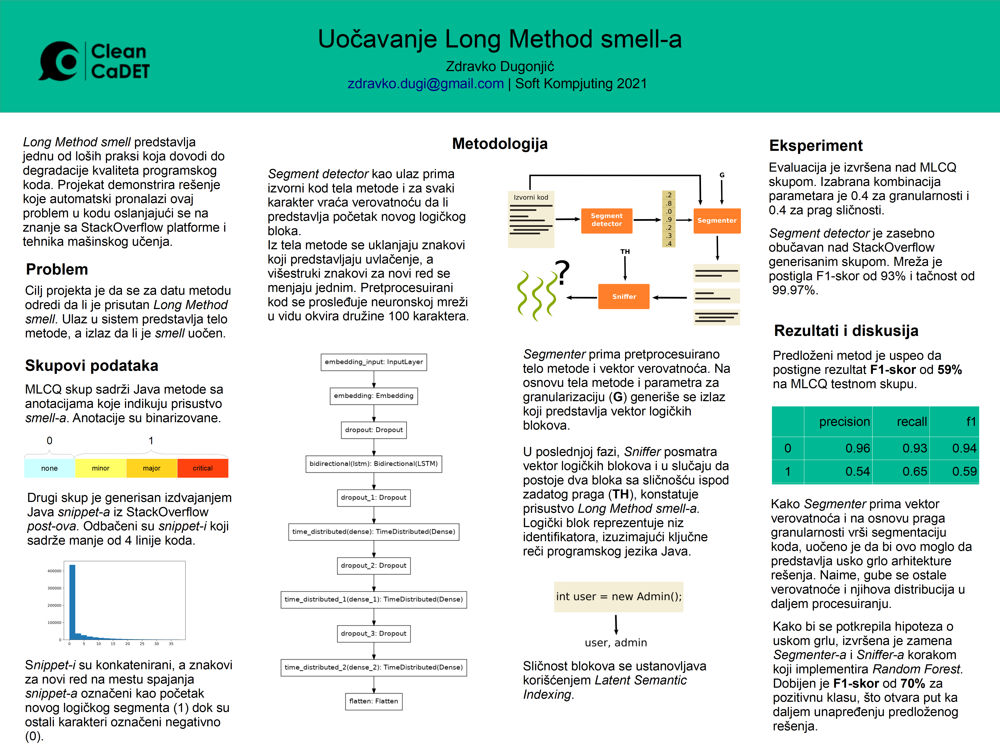

# LongMethodDetector

## Autor

- Zdravko Dugonjić SW25/2017

## Mentori

- prof. Jelena Slivka
- asisten Dragan Vidaković

## Implementacija
Projekat je implementiran u nekoliko različitih faza, izdeljenih na tri Jupyter Notebooka.

- Analiza, prikupljanje i generisanje StackOverflow skupa: [lmd-stackoverflow.ipynb](notebooks/lmd-stackoverflow.ipynb)
- Trening Segment Detector modula: [Segment_detector.ipynb](notebooks/Segment_detector.ipynb)
- Integracija svih faza i rezultati: [cadet-lsi-report.ipynb](notebooks/cadet-lsi-report.ipynb)

## Podaci
- StackOverflow postovi: dostupnan u okviru Google BigQuery public datasets (StackOverflow dataset)
- [MLCQ](https://zenodo.org/record/3666840)

## Literatura
DORMUTH, Jacob, et al. Logical segmentation of source code. arXiv preprint arXiv:1907.08615, 2019.

PALOMBA, Fabio. Textual analysis for code smell detection. In: 2015 IEEE/ACM 37th IEEE International Conference on Software Engineering. IEEE, 2015. p. 769-771.
## Dodatak
- Pretprocesuirani podaci generisani na osnovu StackOverflow snippet-a se mogu pronaci u zipu direktorijuma *data*. Uz podake stoje i odgovarajuće anotacije u zasebnoj *labels* datoteci.
- Istrenirani model Segment Detector-a nalazi se u direktorijumu *models*.
- Korišćeni podskup MLCQ skupa se nalazi u *data*.